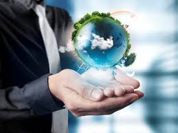
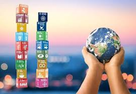
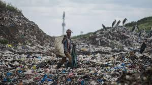
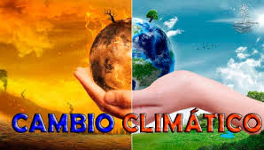

# Sostenibilidad-Gilber

Esto es un repositorio para la asignatura de Sostenibilidad aplicada al sector productivo , para el curso 2025/2026.

Alumno: Gilberto Gil Gandia. :)

## ENERO

### 16/01/2026 DIA(15)

#### Resumen de Clase:
En la clase de hoy vamos a tratar el tema de la agenda 2030 y los objetivos de desarrollo sostenible. Hablamos de los objetivos de la agenda 2030. El rey CarlosIII es el mas rico de Inglaterra. Para instaurar el grado superior de DAM , fue gracias a dinero de Europa despues de la pandemia. Los ODS  se basan en tres circulos, Ambiental, Social y Economica y de Gobernanza. Hemos dividido la clase en doa, para realizar una busqueda de argumentos ODS a favor y otros en contra. ¿Crees que se vana conseguir los ODS?

#### Conlusion:

En la clase se trató el tema de la Agenda 2030 y los Objetivos de Desarrollo Sostenible (ODS), explicando su finalidad y estructura. Se comentó que los ODS se apoyan en varios pilares fundamentales: el ambiental, el social, el económico y el de gobernanza, que buscan un desarrollo equilibrado y sostenible a nivel global.
También se mencionaron ejemplos que reflejan las desigualdades económicas, como el hecho de que el rey Carlos III sea una de las personas más ricas de Inglaterra, y se habló del papel de Europa en la financiación de proyectos educativos, como la implantación del grado superior de DAM tras la pandemia.
Finalmente, la clase se dividió en dos grupos para investigar y debatir argumentos a favor y en contra de los ODS, fomentando el pensamiento crítico y el análisis de este modelo de desarrollo.

#### Reflexión:

La Agenda 2030 plantea un marco ambicioso para mejorar el mundo, pero también genera debate sobre su aplicación real y su impacto. Mientras que los ODS buscan reducir desigualdades y proteger el planeta, la existencia de grandes diferencias económicas y la dependencia de ayudas externas ponen en duda si todos los países parten de las mismas condiciones para cumplirlos.
El debate en clase demuestra que no basta con aceptar los ODS como una solución perfecta, sino que es necesario analizarlos críticamente, entender quién los financia, quién se beneficia de ellos y cómo se llevan a la práctica. Solo desde una visión crítica y participativa se puede avanzar hacia un desarrollo verdaderamente sostenible.

En cuanto a la pregunta de clase, ¿Crees que se vana conseguir los ODS?: 

En mi opinión, es poco probable que los ODS se cumplan al 100 % en 2030, al menos de forma global. Son objetivos muy ambiciosos y el mundo avanza a ritmos muy distintos según el país. Las desigualdades económicas, los conflictos, las crisis sanitarias, el cambio climático y los intereses políticos y económicos hacen que muchos de estos objetivos avancen más despacio de lo previsto.

## ENERO

### 09/01/2026 DIA(14)

#### Resumen de Clase:
En la clase de hoy vamos a tratar el tema de la contaminación y los residuos. Tratamos el tema de los residuos organicos y como se podrian aprovechar para realizar compost, se podria vender y usar en vez de productos quimicos que se producen con petroleo y elementos mas nocivos que favorecen mas a la contaminacion. Algunos paises africanos , como Ghana, tienen vertederos enormes donde llegan reisudos de todo el mundo, ellos se dieron cuenta que podian extraer elementos de esos residuos y aprovecharlos y sacar provecho de ello, ya que suelen ser zonas de bajos recursos económicos. 

Por otro lado, tratamos los diprumtores hormonales, junto con la bioacumulacion, el ser vivo pequeño es comido por uno mas grande y ese grande por otro mas grande y finalmente nosotros nos comemos al ultimo mas grande, siendo asi nosotros el filtro final. La ropa es otro tema a tratar como residuos, como los vertederos de ropa en Chile o Ghana. Pregunta final ¿Porque cambias de móvil?

#### Conlusion:

En la clase de sostenibilidad se abordó el problema de la contaminación y la gestión de residuos, analizando distintos tipos y su impacto ambiental y social.

Por un lado, se trataron los residuos orgánicos y su aprovechamiento mediante la producción de compost. Este proceso permite transformar restos de comida y materia orgánica en un abono natural que puede utilizarse en la agricultura, reduciendo el uso de productos químicos derivados del petróleo, que son más contaminantes y perjudiciales para el medio ambiente.

También se habló de la situación en algunos países africanos, como Ghana, donde existen grandes vertederos que reciben residuos de todo el mundo. Aunque estos lugares reflejan una gran desigualdad y un grave problema ambiental, sus habitantes han encontrado formas de extraer materiales valiosos de los desechos (metales, componentes electrónicos, etc.) para reutilizarlos o venderlos, como medio de subsistencia en zonas con pocos recursos económicos.

Otro tema importante fue el de los disruptores hormonales y la bioacumulación. Se explicó cómo sustancias tóxicas presentes en el medio ambiente pasan de un ser vivo pequeño a otro más grande a través de la cadena alimentaria, acumulándose progresivamente hasta llegar a los seres humanos, que actuamos como el “filtro final”.

Por último, se trató la industria textil y la ropa como residuo, destacando los enormes vertederos de ropa en países como Chile o Ghana, consecuencia del consumo excesivo y la moda rápida, que genera toneladas de residuos difíciles de gestionar.

#### Reflexión:

Esta clase pone de manifiesto que el problema de los residuos no es solo ambiental, sino también social y económico. Muchas de las decisiones de consumo que se toman en los países más desarrollados tienen consecuencias directas en otras partes del mundo, donde los residuos terminan acumulándose y afectando a comunidades vulnerables.

Al mismo tiempo, se observa que los residuos también pueden convertirse en una oportunidad, como ocurre con el compost o la reutilización de materiales, siempre que se gestionen de forma responsable y segura. Sin embargo, no debería recaer en los países con menos recursos la carga de gestionar los desechos del resto del mundo.

## DICIEMBRE

### 12/12/2025 DIA(13)

#### Resumen de clase:
El tema a tratar en la clase de hoy es el cambio climatico (El Multiplicador de Amenazas). Es una realidad que todos podemos percibir y ademas de alguna manera nos tiene preocupados. La evidencia es inequívoca, aumento de temperatura, eventos extremos, deshieloy nivel del mar. Porcentaje de gases de efecto invernadero. Cascada de fallos: Agua, Alimentos y Migraciones. Mitigacion (energias renovables, movilidad sostenible, eficiencia energética).

¿Cual es el principal emisor de CO2?
La quema de combustibles fósiles para la generación de energía (electricidad, calefacción, transporte) y en la industria.

¿Que puedo hacer como programador para mitigar el cambio climatico? 
Vamos a ponernos en la situacion de que trabajamos para OpenAi y suponemos que consumimos 100 unidades de energia y tenemos que reducirlo a 50 unidades, por tanto haremos una propuesta un tanto radicalpero con un toque ecológico:
1) Optimización de modelos y pipelines

Distilación y pruning de modelos: Reducir tamaño de modelos sin perder precisión para disminuir uso de GPU.
Optimización de batch size y pipelines: Ajustar tamaños de lote y flujos de datos para minimizar cálculos redundantes.
Inferencia eficiente: Cachear resultados frecuentes para reducir recomputaciones.
Impacto esperado: 20–25 unidades de ahorro.

2) Uso estratégico de la nube y energía renovable

Ejecutar entrenamientos durante horarios con alta disponibilidad de energía renovable.
Migrar cargas de trabajo a regiones donde la energía sea 100% renovable.
Priorizar proveedores de nube que reporten eficiencia energética y certificación verde.

Impacto esperado: 15–20 unidades de ahorro.

3) Codificación y compiladores eficientes

Usar librerías optimizadas para GPU/TPU que reduzcan operaciones innecesarias.
Detectar cuellos de botella en el código que generan cálculos redundantes.
Automatizar revisión de eficiencia en pipelines de desarrollo.

Impacto esperado: 5–10 unidades de ahorro.

4) Infraestructura y monitoreo

Implementar dashboards de consumo energético por modelo/proyecto para tomar decisiones basadas en datos.
Automatizar alertas cuando un servicio o modelo supere el consumo previsto.
Apagar servidores o procesos inactivos de forma automática.

Impacto esperado: 5–10 unidades de ahorro. 

### 05/12/2025 DIA(12)

#### Resumen de clase:
El tema que vamos a tratar hoy es huella ecológica y huella de carbono, ¿Cuánto pesas en el planeta?. Huella ecologica (Demanda VS Oferta/¿Que mide?/Unidad de medida, hag = hectareas globales). Huella de Carbono (Qué mide: Las emisiones de gases de efecto invernadero (como el CO2) generadas por una actividad humana, producto o servicio, representa mas del 60% del impacto total.) Necesitamos 1.7 planetas para seguir manteniendo el ritmo actual de consumo. Tambien hay una sostenibilidad entre hardware y software. El profesor nos ha enseñado una web (footprintcalculator) para calcular nuestra huella de carbono y ecologica, es decir, si todo el mundo viviese exactamente como uno mismo, cuantas tierras harian falta. En mi caso he hecho las preguntas para intentar conseguir un impacto minimo en el planeta: 

#### Conlusion/Reflexión:
La reflexión sobre la huella de carbono y ecológica es que son herramientas vitales para medir y comprender nuestro impacto ambiental, y su reducción es crucial para un futuro sostenible. La huella de carbono se enfoca en las emisiones de gases de efecto invernadero y su conexión con el cambio climático, mientras que la huella ecológica abarca un impacto más amplio, considerando la cantidad de recursos naturales que consumimos y los residuos que generamos.

### 28/11/2025 DIA(11)

#### Resumen de clase:
El tema que vamos a ir tratando en la clase de hoy es la Economia Lineal vs Ecnomia Circular. Tratamos el ejemplo del proceso de desguazado de un coche y sobre el valor economico que tiene este subproducto. El modelo actual estaria mas enfocado a la economia lineal, no seria lineal al 100% pero si en gran parte. Esta economia lineal a l larga tendra una serie de consecuencias. Por otro lado en la circular tenemos principios como Ecodiseño, Prioridad(Reutilizar y Reparar) e Integracion. Y finalmente el caliz sagrado, seria la Economia Verde.

Pregunta: ¿Y a mi que me cuentas? ¿Enfoque colectivo o individual?

#### Conlusion/Reflexión:
La economía lineal nos ha llevado durante años por un camino sencillo: usar y tirar. Funciona rápido, pero también desperdicia materiales valiosos, como ocurre cuando un coche llega al desguace y gran parte de su potencial se pierde. La economía circular, en cambio, nos invita a mirar esos restos con otros ojos: reutilizar, reparar, rediseñar y dar una segunda vida a lo que aún tiene valor. Es un enfoque más consciente, que nos acerca a la idea de una economía verde, donde producir no implique dañar, sino convivir mejor con nuestro entorno.

Y la gran pregunta es: ¿estamos dispuestos a cambiar nuestros hábitos, o solo nos gusta la idea de hacerlo?

### 21/11/2025 DIA(10)

Hoy no pudimos hablar nada en la clase de Sostenibilidad, el profesor no pudo venir a la clase.

### 14/11/2025 DIA(9)

#### Resumen de clase:

Comenzamos la clase hablando sobre como mejorar la estructura de la bitacora. El profesor nos comenta que tenemos que añadir una imagen a nuestra bitacora. Seguimos la clase tratando el analisis del ciclo de vida, ¿Cómo es posible este peso oculto?. Profundizando en las distintas formas o tipos de energia de nuestro planeta, las relacionamos con la Economia lineal (Extraer, fabricar, consumir y desechar) y Economia circular (Reducir, reutilizar y reciclar)
Preguntar a la IA ¿Cuantas toneladas hacen falta para producir el material que prefiera, residuos, energia que se emplea? (Materias primas)

#### Materia prima escogida: TANZANITA
¿Qué es la tanzanita?

Es una variedad azul-violeta del mineral zoisita. 

Su fórmula química incluye calcio, aluminio, silicato e hidroxilo. 

Solo se extrae en una zona muy concreta: las colinas de Merelani, en el norte de Tanzania. 

Tiene una dureza de entre ~6.5 y 7 en la escala de Mohs, por lo que no es tan dura como otras gemas “clásicas” como el zafiro. 

Mucha tanzanita se somete a un tratamiento térmico para mejorar su color (se calienta para eliminar tonos marrones o rojizos y potenciar el azul/violeta). 

##### Energías involucradas en su extracción

Cuando hablamos de “energías” en la extracción, podemos referirnos tanto al consumo energético como a los “costos energéticos” más amplios (sociales, ambientales):

##### Maquinaria y excavación

En la mina de Merelani hay operaciones tanto artesanales (muchos mineros locales usando herramientas más básicas) como mecanizadas (compañías como TanzaniteOne operan con equipos más avanzados). 

Las operaciones mecanizadas requieren bastante energía (electricidad o combustible) para maquinaria pesada, ventilación, transporte de mineral, triturado, etc.

##### Salud y ventilación

Hay un riesgo muy alto para los trabajadores por polvo respirable (silica), lo que implica que las minas necesitan ventilación adecuada. 

Un estudio reciente ha mostrado que usando métodos más seguros (como perforación “húmeda”) se puede reducir enormemente la exposición a sílice cristalina. 

También se han reportado gases tóxicos en algunas minas profundas debido a la composición de las rocas (por ejemplo, rocas con grafito) y la escasa ventilación. 

##### Impacto ambiental energético

La minería produce polvo, ruido y vibraciones (por explosiones con dinamita) que requieren uso de energía para la extracción y movimiento de escombros. 

Uso de madera: los mineros artesanales usan mucha madera para apuntalar los túneles, lo que implica deforestación.

##### Residuos que se generan

La minería de tanzanita genera varios tipos de residuos y daños al entorno:

Rocas de desecho (“waste rock”): en la extracción subterránea se extrae mucho material que no contiene tanzanita, y ese material se amontona fuera de los túneles. 

Erosión del suelo: los montones de roca y la remoción del terreno provocan erosión por viento y lluvia, degradando el paisaje local. 

Polvo: durante las explosiones, perforaciones y transporte se libera polvo respirable, que incluye sílice, grafito, micas… 

Contaminación del aire subterráneo: tras las voladuras, si no hay buena ventilación, los gases y partículas pueden quedarse atrapadas en los túneles. 

Impacto sobre la vegetación: para sostenimiento de minas y para cocinar, los mineros utilizan madera, lo que genera deforestación. 

Riesgos socioambientales: también hay reportes de degradación del paisaje, hundimientos, derrumbes y riesgos para la seguridad de los mineros. 

##### Usos de la tanzanita

Joyería: es su uso principal. Se corta en gemas para anillos, collares, pendientes, pulseras, etc., por su color muy apreciado. 

Coleccionismo e inversión: dado que solo existe en un lugar y su oferta es limitada, ciertas piezas (muy buenas, grandes o con color excepcional) son valoradas por coleccionistas. 

Propiedades metafísicas (cristales): en algunos entornos se asocia con la intuición, la calma emocional, el “tercer ojo”, aunque esto es más simbólico o de creencias que un uso técnico real. 

Aplicaciones ópticas / especializadas: algunas fuentes mencionan que, por su índice de refracción y otras propiedades ópticas, podría tener usos muy técnicos, pero no es algo masivo.

##### Cantidad, producción y mercado

Según el Economic Survey de Tanzania, en 2022 se produjeron 90.186,90 kg de tanzanita en bruto. 

También reportan que en 2024 la producción se redujo: ~83.014,66 kg de tanzanita bruta. 

En cuanto a producción por tonelada de mineral: se estima que hay ~52-60 carats de tanzanita por tonelada de mena (el mineral extraído) en algunos bloques. 

TanzaniteOne (una de las compañías más grandes) había fijado una meta de ~2,2 millones de quilates producidos anualmente en un momento. 

Valor económico: según Rough-Polished, la producción anual de tanzanita en bruto se estima en ~80 millones USD, y si se contabiliza su venta una vez tallada y pulida, la cifra puede subir considerablemente.

##### Sostenibilidad y alternativas

Se han propuesto y probado prácticas más seguras: por ejemplo, la perforación húmeda reduce mucho el polvo de sílice, lo que protege la salud de los trabajadores. 

Existe tanzanita sintética (“synthetic tanzanite”), que podría ser una alternativa más sostenible: no requiere tanta minería, y su fabricación controlada reduce el impacto ambiental. 

También hay iniciativas para regular y supervisar mejor la minería de tanzanita en Tanzania, mejorar las condiciones laborales, y reducir la evasión ilegal.

##### Conclusión / reflexión

La tanzanita es un mineral muy valioso y muy raro, lo que la hace apetecible para joyería y como inversión.

Su extracción conlleva costos ambientales y sociales significativos: residuos, polución, riesgos para los mineros, degradación del paisaje.

Hay opciones para hacer la minería más responsable (mejor ventilación, tecnologías más limpias, prácticas más seguras) y alternativas como la tanzanita sintética, pero no todo se ha implementado por completo.

El equilibrio entre explotar este recurso económico y preservar el entorno y la salud de las personas es complejo: es un ejemplo claro de desafío sostenible.

#### Reflexion
El análisis del ciclo de vida nos abrió los ojos al “peso oculto” de los productos: aquello que no vemos, pero que existe en forma de recursos, energía y residuos generados desde que un objeto se extrae hasta que se desecha. Entender esto nos ayuda a mirar más allá de la superficie y cuestionar el verdadero impacto de lo que consumimos.

### 07/11/2025 DIA(8)

Hoy al llegar a clase y esperar por unos 15 min, nos informan que el profesor no asistirá a la clase, por tanto, la clase de hoy no será muy interesante. Fin

### 31/10/2025 DIA(7)

Comenzamos tratando el tema de si la Tierra es un sistema finito. La tierra dispone de una cantidad limitada de materiales, energia y espacio. Ciclo cerrado de la biosfera, todos los residuos se convierten en recursos. En todo este proceso nos comemos a nuestros antepasados. La sostenibilidad exige cerrar los ciclos para que haya un equilibrio en el ecosistema. Cómo podemos mantener el equilibrio?. 

### 24/10/2025 DIA(6)

Comenzamos la clase tratando las estrategias de crecimiento de la R y la K: Somos todos lo seres vivos iguales? No, en el planeta hay mucha diversidad. Estrategia k (Crecimiento Poblacional Lento, Baja Reproduccion e Inversion parental). Estrategia R (especie oportunista) ¿Que estrategia usamos los humanos? A lo largo de la historia hemos tenido momentos de R y K, pero a predominado en mayor medida la K. 

#### Reflexion de la clase:
En la clase de hoy comprendí que no todos los seres vivos siguen el mismo camino para sobrevivir. Mientras algunas especies crecen rápido y se reproducen mucho (estrategia R), otras prefieren avanzar más despacio, cuidando mejor a sus crías y asegurando su estabilidad (estrategia K). Pensando en los humanos, me doy cuenta de que a lo largo de la historia hemos pasado por momentos de ambas estrategias, pero en general predominamos en la K: invertimos tiempo, esfuerzo y recursos en garantizar nuestro bienestar y el de las próximas generaciones. Creo que el verdadero reto está en mantener un equilibrio entre adaptarnos con rapidez, como las especies R, y conservar la planificación y el cuidado que caracterizan a la estrategia K.

En resumen, crecer con inteligencia, pero sin olvidar la capacidad de adaptarnos.

### 17/10/2025 DIA(5)

Comenzamos la clase de hoy con la pregunta ¿Vivimos solos?. Las relaciones entre especies, ninguna vive aislada, todas interactuan con alguna otra. Relaciones intraespecificas e interespecificas (mutualismo, parasitismo....)
La denominacion de origen de la trufa negra en Sarrion. ¿Que hacemos nosotros: cooperamos o competimos?.

La clase de hoy nos hizo pensar en como, al igual que en la naturaleza, ningún ser vivo existe de manera aislada. 
Todas las especies dependen unas de otras, ya sea cooperando o compitiendo. 
Las relaciones intraespecificas e interespecíficas muestran que la interacción es esencial para el equilibrio del ecosistema. 
El ejemplo de la trufa negra en Sarrión refleja cómo la cooperación humana con el entorno y entre personas puede generar desarrollo y sostenibilidad significativo. 
En mi opinión, vivir no es hacerlo solo, sino aprender a convivir y colaborar para prosperar juntos. 

### 10/10/2025 DIA(4)

Concepto de hoy "capacidad de carga de un ecosistema", "importancia ecológica", si mantenemos la capacidad de carga podremos asegurar la salud ,la funcionalidad y la viabilidad del ecosistema a lo largo del tiempo 
La capacidad de carga es determinada por una serie de factores = disponibilidad de agua, territorio, recursos ,es decir, 
sobreexplotación de los limites.

#### Reflexion de la clase:
Hemos comprendido que la capacidad de carga representa el límite natural que un entorno puede soportar sin degradarse, es decir, 
la cantidad máxima de seres vivos incluidos nosotros, los humanos, que pueden vivir en equilibrio con los recursos disponibles en nuestra placa petri (Tierra).

¿¿Hay un límite para la población humana?? 
Si, existe un limite , digamos que no es facil de predecir dicho limite pero esta claro que la tierra tiene una capacidad de carga determinada respecto a agua
,alimentos, energia e incluso espacio. Si seguimos este ritmo y sin cambiar ciertos habitos, llegará un punto donde nos acerquemos a nuestra curva de decrecimiento. Ya que no tendremos
suficientes recursos para mantener nuestro ritmo de vida.
Sin embargo, este límite no depende solo del número de personas, sino de cómo utilizamos los recursos.

En mi opinión, considero que el verdadero reto no es "cuántos somos" sino "cómo vivimos" dentro de los limites de nuestro planeta.

### 03/10/2025 DIA(3)

Empezamos tratanto el tema de si somos animales o no. Nuestra base biologica, "Estamos formados por las mismas piezas".
Nos diferenciamos en nuestro lenguaje complejo/tecnologia/cultura transmisible.
¿Acabaremos con la vida en nuestro planeta?

#### Pequeña Reflexion: 
Aunque a menudo pensamos que estamos separados de la naturaleza, en realidad somos animales con la misma base biológica que el resto de los seres vivos. Lo que nos distingue lenguaje, tecnología y cultura,esto nos da un gran poder para transformar el planeta, pero también una gran responsabilidad.
La pregunta sobre si acabaremos con la vida en la Tierra nos recuerda que nuestro futuro depende de usar ese poder con equilibrio y sostenibilidad.

### 26/09/2025 DIA(2)

Hablamos del concepto de sostenibilidad, (no caiga,sujetar, necesidad,problema,) , la variable tiempo
¿Queremos que una civilizacion sea estable?. 3 dimensiones fundamentales:ambiental, social y economica

Ecologia vs Ecologismo 
  ||           ||   
Ciencia     Politica 

¿Reflexion final de la clase?   

La sostenibilidad no es solo una meta ambiental, sino un equilibrio que necesitamos mantener entre el medio ambiente, la sociedad y la economía para que
cualquier civilización pueda perdurar en el tiempo.
No nos basta con cuidar los recursos naturales si por otro lado no atendemos el bienestar social y el desarrollo económico: 
estas tres dimensiones deberian de avanzar juntas.

Por otro lado, hemos hablado de que era la ecologia y el ecologismo. La ecología nos aporta el conocimiento científico para entender cómo funcionan los ecosistemas, mientras que el ecologismo representa la acción política para "protegerlos".
Ambas son necesarias, pero es importante no confundir ciencia con ideología.

En definitiva, la sostenibilidad nos recuerda que el tiempo es limitado para actuar y que nuestras acciones actuales tendrán consecuencias para las generaciones futuras. 
Ser sostenibles es aprender a vivir con la naturaleza sin sacrificar el progreso humano ni la propia naturaleza.

Si queremos que nuestra civilización sea estable y justa, debemos asumir que cuidar del planeta va de la mano de cuidar de nosotros mismos.

Y yo me pregunto: ¿Crees que como individuos tenemos más poder del que imaginamos para influir en ese equilibrio.?

##SEPTIEMBRE 

### 19/09/2025 DIA(1)

 

